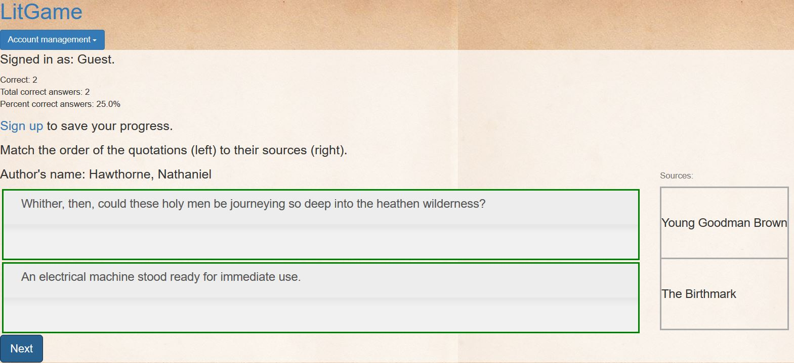

# LitGame

Name: James Bigland

Online Demo: [https://litgame.pythonanywhere.com/](https://litgame.pythonanywhere.com/)

Project Title: LitGame

Course:  [CCPS530](https://ce-online.ryerson.ca/ce/calendar/default.aspx?id=5&section=course&mode=course&ccode=CCPS+530)

Instructor: [Ghassem Tofighi](https://ghassem.com/)

LitGame is a literature trivia game. To play, one must match the order of quotations and sources from classic literature.

## Featured Technologies

[Flask](http://flask.pocoo.org/docs/1.0/) a Python micro web framework

[WTForms](https://wtforms.readthedocs.io/en/stable/) and [Flask_WTF](https://flask-wtf.readthedocs.io/en/stable/) for form construction, validation, and CSRF protection.

[SQLAlchemy](https://www.sqlalchemy.org/) and [Flask_SQLAlchemy](http://flask-sqlalchemy.pocoo.org/2.3/) CRUD database operations

[passlib](https://passlib.readthedocs.io/en/stable/) to salt and hash user passwords

[nltk](https://www.nltk.org/) for sentence tokenization 

[jQuery](https://jquery.com/) for DOM manipulation

[jQuery UI](https://jqueryui.com/) and [jQuery UI Touch Punch](http://touchpunch.furf.com/) for a touchscreen friendly sortable widget

## Quick Start Guide

To get this Flask site running locally:

0. Make sure you have Python 3.6 available. `python --version`
1. Download this code.
2. Find a suitable replacement background image. The demo background image file "[paper-texture-1145467.jpg](https://www.freeimages.com/photo/paper-texture-1145467)" is not included in this repo. Place your replacement background image in static/img.
3. Find a suitable replacement flavicon (.ico) file. The demo flavicon "[favicon.ico](https://www.freefavicon.com/freefavicons/objects/iconinfo/stylized-book-152-171437.html)" is not included in this repo. Place your replacement flavicon in static/.
4. Pip install all requirements in requirements.txt: `pip install -r requirements.txt`
5. To run locally run: `python routes.py`

Before deploying, be sure to change the `app.config['SECRET_KEY']` and turn off debugging by remove the optional arguments from `app.run()`.

## Customization
To serve quotations from authors of your choice, you must populate the database table `quote`. To start remove/rename quote_db.sqlite, and run `python db_init.py`. This will create a new quote_db.sqlite file. To populate the database run `python populate_db.py` and follow the interactive prompts.

## Limitations
This project can only support single author works.

## Supported Browsers
1. Latest: Chrome, Firefox, Opera, Edge, Safari
2. Internet Explorer 11

## Future Improvements
* [ ] Change the number of quotations displayed in a quiz from 3 to 2. User testing suggests this will improve the game experience.

* [ ] Allow users to change their username, email address, and password.

* [ ] Allow users to opt-in to displaying their scores in a publicly accessible "high score" table.

* [ ] Add support for IE 9 and 10.
